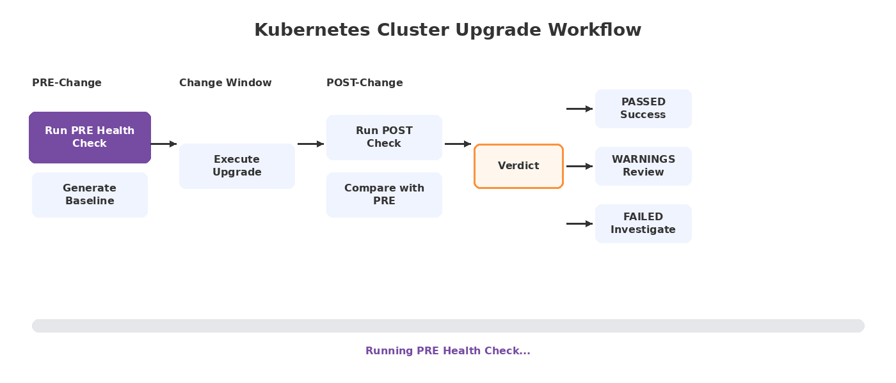

<div align="center">

# Kubernetes Health & Ops Toolkit

**Health Check, Upgrade & Multi-Cluster Operations for VMware Tanzu**

[]()
[]()
[](LICENSE)
[]()
[]()

</div>

---

## Table of Contents

- [What is This?](#what-is-this)
- [When Should I Use This?](#when-should-i-use-this)
- [Quick Start](#quick-start)
- [The Three Scripts](#the-three-scripts)
  - [Health Check](#1-health-check-k8s-health-checksh)
  - [Cluster Upgrade](#2-cluster-upgrade-k8s-cluster-upgradesh)
  - [Multi-Cluster Operations](#3-multi-cluster-operations-k8s-ops-cmdsh)
- [Architecture](#architecture)
- [Configuration](#configuration)
- [Output & Reports](#output--reports)
- [Health Check Sections](#health-check-sections)
- [Troubleshooting](#troubleshooting)
- [Version History](#version-history)
- [License](#license)

---

## What is This?

A production-ready toolkit for managing Kubernetes clusters in VMware Kubernetes Service environments. Three scripts that automate health validation, orchestrate upgrades, and execute commands across multiple clusters through Tanzu Mission Control integration.

**Built for**: Platform engineers and SREs managing VKS clusters who need reliable pre/post change validation, automated upgrades with rollback safety, and efficient multi-cluster operations.

---

## When Should I Use This?

| Scenario | Script | Example |
|----------|--------|---------|
| Before/after Kubernetes upgrades | `k8s-health-check.sh` | PRE/POST validation with comparison reports |
| Automated cluster upgrades | `k8s-cluster-upgrade.sh` | Upgrade with health gates and monitoring |
| Audit multiple clusters | `k8s-ops-cmd.sh` | Check versions, node counts across all clusters |
| Change management validation | `k8s-health-check.sh` | Generate comparison reports for change tickets |
| Troubleshooting cluster issues | `k8s-health-check.sh` | 18-section diagnostic report |

---

## Quick Start

```bash
# 1. Clone and configure
git clone https://github.com/your-org/kubernetes-health-ops-toolkit.git
cd kubernetes-health-ops-toolkit

# 2. Edit TMC endpoints (one-time setup)
vi lib/tmc-context.sh
# Set NON_PROD_DNS and PROD_DNS on lines 7-8

# 3. Configure Supervisor IPs for vSphere login (one-time setup)
vi lib/vsphere-login.sh
# Update SUPERVISOR_IP_MAP with actual Supervisor cluster IPs/FQDNs (lines 16-26)

# 4. Create cluster list
cat > input.conf << EOF
prod-workload-01
prod-workload-02
uat-system-01
EOF

# 5. Make scripts executable
chmod +x k8s-health-check.sh k8s-cluster-upgrade.sh k8s-ops-cmd.sh

# 6. Run your first health check
./k8s-health-check.sh --mode pre
```

---

## The Three Scripts

### 1. Health Check (`k8s-health-check.sh`)

Captures comprehensive cluster state before and after changes. Runs 18 health check modules and produces reports with **HEALTHY** / **WARNINGS** / **CRITICAL** status.

```bash
# PRE-change baseline (parallel, 6 clusters at a time)
./k8s-health-check.sh --mode pre

# Single cluster health check
./k8s-health-check.sh --mode pre -c prod-workload-01

# POST-change with comparison to latest PRE (uses latest/ directory automatically)
./k8s-health-check.sh --mode post
```

| Option | Description |
|--------|-------------|
| `--mode pre\|post` | Check mode (required) |
| `-c, --cluster NAME` | Single cluster (no input.conf needed) |
| `--sequential` | One cluster at a time (default: parallel) |
| `--batch-size N` | Clusters per parallel batch (default: 6) |
| `--cache-status` | Show cache status |
| `--clear-cache` | Clear all cached data |

**Health Status Classification:**

| Status | Criteria |
|--------|----------|
| **CRITICAL** | Nodes NotReady > 0 OR Pods CrashLoopBackOff > 0 |
| **WARNINGS** | Pods Pending > 0, Unaccounted > 0, Deployments/DaemonSets/StatefulSets NotReady > 0, PVCs NotBound > 0, Helm Failed > 0 |
| **HEALTHY** | None of the above |

---

### 2. Cluster Upgrade (`k8s-cluster-upgrade.sh`)

Orchestrates cluster upgrades with PRE/POST health checks and progress monitoring. **v4.2+ includes interactive version selection** to choose specific Kubernetes versions before upgrade.

```bash
# Default: Use ./input.conf (sequential)
# You'll be prompted to select version for each cluster
./k8s-cluster-upgrade.sh

# Single cluster upgrade with version selection
./k8s-cluster-upgrade.sh -c prod-workload-01

# Parallel batch upgrades (6 at a time)
# Version selection happens sequentially in Phase 1
./k8s-cluster-upgrade.sh --parallel

# Parallel with custom batch size
./k8s-cluster-upgrade.sh --parallel --batch-size 3

# Dry run
./k8s-cluster-upgrade.sh -c prod-workload-01 --dry-run
```

| Option | Description |
|--------|-------------|
| `-c CLUSTER` | Upgrade a single cluster |
| `--parallel` | Run upgrades in parallel batches |
| `--batch-size N` | Clusters per batch in parallel mode (default: 6) |
| `--timeout-multiplier N` | Minutes per node for timeout (default: 5) |
| `--dry-run` | Show what would be done without executing |

#### Interactive Version Selection (v4.2+)

Starting from v4.2, cluster upgrades support interactive version selection. Before upgrading, you'll see a list of all available Kubernetes versions for your cluster and can choose which version to upgrade to.

**How it works:**
1. After confirming the upgrade, available versions are queried from TMC
2. Versions are displayed as a numbered list (newest first)
3. Select a version number or choose option 0 for "latest"
4. The upgrade proceeds to your selected version

**Example:**
```
=== Upgrade Version Selection ===
Cluster: prod-workload-01
Current Version: v1.28.8+vmware.1

Available upgrade versions:
  0) Use latest available version
  1) v1.30.14+vmware.1
  2) v1.29.15+vmware.1
  3) v1.29.14+vmware.1

Select version number (0-3) or 'c' to cancel: 2

Selected version: v1.29.15+vmware.1
```

**Features:**
- Works in both sequential and parallel upgrade modes
- Input validation with retry attempts (max 3)
- Cancel at any time with 'c'
- Graceful fallback to `--latest` if version query fails
- Target version logged in upgrade logs for audit trail

---

### 3. Multi-Cluster Operations (`k8s-ops-cmd.sh`)

Executes commands across multiple clusters with parallel batch execution.

```bash
# Single cluster
./k8s-ops-cmd.sh -c prod-workload-01 "kubectl get nodes"

# All clusters from config
./k8s-ops-cmd.sh "kubectl get nodes --no-headers | wc -l"

# Discovery from TMC management cluster
./k8s-ops-cmd.sh -m prod-1 "kubectl get nodes"

# Check Kubernetes version across clusters
./k8s-ops-cmd.sh "kubectl get nodes --no-headers | awk '{print $5}' | head -1"
```

| Option | Description |
|--------|-------------|
| `-c, --cluster NAME` | Run on a single cluster |
| `-m, --management-cluster ENV` | Discover clusters from TMC management cluster |
| `--timeout SEC` | Command timeout in seconds (default: 30) |
| `--sequential` | One cluster at a time (default: parallel) |
| `--batch-size N` | Clusters per batch (default: 6) |

---

## Architecture

### Upgrade Workflow



**Workflow Steps:**
1. **PRE-Change**: Run comprehensive health check and generate baseline metrics
2. **Change Window**: Execute cluster upgrade with monitoring
3. **POST-Change**: Run health check and compare with PRE baseline
4. **Verdict**: Automatic classification (PASSED ✓ / WARNINGS ⚠ / FAILED ✗)

---

### Script Architecture

```
┌─────────────────────────────────────────────────────────────────────────────────────────┐
│                                   🎯 MAIN SCRIPTS                                        │
├─────────────────────────────┬─────────────────────────────┬─────────────────────────────┤
│                             │                             │                             │
│  📊 k8s-health-check.sh    │  ⬆️ k8s-cluster-upgrade.sh  │  🔧 k8s-ops-cmd.sh          │
│  ─────────────────────      │  ────────────────────────   │  ───────────────            │
│  • PRE/POST validation      │  • Upgrade orchestration    │  • Multi-cluster ops        │
│  • 18 health modules        │  • Health gates             │  • Parallel execution       │
│  • Comparison reports       │  • Progress monitoring      │  • TMC discovery            │
│                             │                             │                             │
└──────────────┬──────────────┴──────────────┬──────────────┴──────────────┬──────────────┘
               │                             │                             │
               │                             │ delegates                   │
               ▼                             ▼                             ▼
┌─────────────────────────────────────────────────────────────────────────────────────────┐
│                              📦 LIBRARY MODULES (lib/)                                   │
├─────────────────────────────┬─────────────────────────────┬─────────────────────────────┤
│                             │                             │                             │
│  common.sh    - Utilities   │  tmc-context.sh - Contexts  │  health.sh     - Metrics    │
│  config.sh    - Parsing     │  tmc.sh         - TMC API   │  comparison.sh - PRE/POST   │
│                             │                             │                             │
└─────────────────────────────┴──────────────┬──────────────┴─────────────────────────────┘
                                             │
                                             ▼
┌─────────────────────────────────────────────────────────────────────────────────────────┐
│                        📋 18 HEALTH CHECK SECTIONS (lib/sections/)                       │
├─────────────────────────────┬─────────────────────────────┬─────────────────────────────┤
│  01-cluster-overview        │  07-antrea-cni              │  13-resource-quotas         │
│  02-node-status             │  08-tanzu-vmware            │  14-events                  │
│  03-pod-status              │  09-security-rbac           │  15-connectivity            │
│  04-workload-status         │  10-component-status        │  16-images-audit            │
│  05-storage-status          │  11-helm-releases           │  17-certificates            │
│  06-networking              │  12-namespaces              │  18-cluster-summary         │
└─────────────────────────────┴──────────────┬──────────────┴─────────────────────────────┘
                                             │
                                             ▼
┌─────────────────────────────────────────────────────────────────────────────────────────┐
│                               🌐 EXTERNAL TOOLS                                          │
├─────────────────────────────┬─────────────────────────────┬─────────────────────────────┤
│        tanzu CLI            │          kubectl            │            jq               │
└─────────────────────────────┴─────────────────────────────┴─────────────────────────────┘
```

---

### Health Status Decision Tree

```
┌─────────────────────────────────────────────────────────────────────────────────────────┐
│                                 🔍 COLLECT METRICS                                       │
│                                                                                         │
│                    Nodes, Pods, Workloads, Storage, Helm Releases                       │
└─────────────────────────────────────────┬───────────────────────────────────────────────┘
                                          │
                                          ▼
┌─────────────────────────────────────────────────────────────────────────────────────────┐
│                              ❓ Nodes NotReady > 0?                                      │
└───────────────┬─────────────────────────────────────────────────────────┬───────────────┘
                │                                                         │
                │ YES                                                     │ NO
                ▼                                                         ▼
┌───────────────────────────────┐                     ┌───────────────────────────────────┐
│        🔴 CRITICAL            │                     │    ❓ Pods CrashLoopBackOff > 0?  │
│        ───────────            │                     └─────────────────┬─────────────────┘
│                               │                                       │
│  • Abort upgrade              │◄──────────── YES ─────────────────────┤
│  • Investigate immediately    │                                       │ NO
│  • Alert team                 │                                       ▼
│                               │                     ┌───────────────────────────────────┐
└───────────────────────────────┘                     │  ❓ Pending/NotReady/Unaccounted? │
                                                      └─────────────────┬─────────────────┘
                                                                        │
                                          ┌─────────────────────────────┼─────────────────┐
                                          │ YES                                           │ NO
                                          ▼                                               ▼
                          ┌───────────────────────────────┐       ┌───────────────────────────────┐
                          │        🟡 WARNINGS            │       │        🟢 HEALTHY             │
                          │        ───────────            │       │        ─────────              │
                          │                               │       │                               │
                          │  • Prompt user for decision   │       │  • Auto-proceed with upgrade  │
                          │  • Monitor closely            │       │  • All systems nominal        │
                          │  • Proceed with caution       │       │  • Safe to continue           │
                          │                               │       │                               │
                          └───────────────────────────────┘       └───────────────────────────────┘
```

```
┌─────────────────────────────────────────────────────────────────────────────────────────┐
│                                   HEALTH STATUS SUMMARY                                  │
├─────────────────────────────┬─────────────────────────────┬─────────────────────────────┤
│        🔴 CRITICAL          │        🟡 WARNINGS          │        🟢 HEALTHY           │
├─────────────────────────────┼─────────────────────────────┼─────────────────────────────┤
│                             │                             │                             │
│  Criteria:                  │  Criteria:                  │  Criteria:                  │
│  • Nodes NotReady > 0       │  • Pods Pending > 0         │  • None of the above        │
│  • Pods CrashLoop > 0       │  • Pods Unaccounted > 0     │                             │
│                             │  • Workloads NotReady > 0   │                             │
│                             │  • PVCs NotBound > 0        │                             │
│                             │  • Helm Failed > 0          │                             │
│                             │                             │                             │
│  Action: ❌ Abort           │  Action: ⚠️ Prompt User     │  Action: ✅ Auto-proceed    │
│                             │                             │                             │
└─────────────────────────────┴─────────────────────────────┴─────────────────────────────┘
```

### Library Modules

| Module | Purpose |
|--------|---------|
| `common.sh` | Logging, colors, utilities, `cleanup_old_files()` |
| `config.sh` | Cluster list parsing, configuration validation |
| `tmc-context.sh` | TMC context auto-creation based on cluster naming |
| `tmc.sh` | TMC integration, metadata discovery, kubeconfig fetching |
| `health.sh` | Health metrics collection and status calculation |
| `comparison.sh` | PRE/POST comparison logic and report generation |
| `vsphere-login.sh` | Automated `kubectl vsphere login` for Supervisor and Workload clusters (runs at end of each script) |

---

## Configuration

### TMC Endpoint Setup

Edit `lib/tmc-context.sh` (lines 7-8):

```bash
NON_PROD_DNS="your-nonprod-tmc.example.com"
PROD_DNS="your-prod-tmc.example.com"
```

### Configuration File (`input.conf`)

Unified configuration with credentials, supervisor mappings, and cluster names:

```
# ===CREDENTIALS===
TMC_USERNAME=ao-username
TMC_PASSWORD=ao-password
NONPROD_USERNAME=non-ao-username
NONPROD_PASSWORD=non-ao-password
# ===END_CREDENTIALS===

# ===SUPERVISORS===
prod-1=supvr-prod-1.example.com
prod-2=supvr-prod-2.example.com
# ===END_SUPERVISORS===

prod-workload-01
prod-workload-02
uat-system-01
```

**Credential priority**: Environment variable > input.conf > interactive prompt.

### Cluster Naming Convention

Cluster names determine the TMC context automatically:

| Pattern | Environment | TMC Context |
|---------|-------------|-------------|
| `*-prod-[1-4]` | Production | tmc-sm-prod |
| `*-uat-[1-4]` | Non-production | tmc-sm-nonprod |
| `*-system-[1-4]` | Non-production | tmc-sm-nonprod |

### vSphere Supervisor IP Configuration

Edit `lib/vsphere-login.sh` (lines 16-26) to configure Supervisor cluster IPs/FQDNs:

```bash
declare -A SUPERVISOR_IP_MAP=(
    ["prod-1"]="<supervisor-prod-1-ip-or-fqdn>"
    ["prod-2"]="<supervisor-prod-2-ip-or-fqdn>"
    ["prod-3"]="<supervisor-prod-3-ip-or-fqdn>"
    ["prod-4"]="<supervisor-prod-4-ip-or-fqdn>"
    ["system-1"]="<supervisor-system-1-ip-or-fqdn>"
    ["system-3"]="<supervisor-system-3-ip-or-fqdn>"
    ["uat-2"]="<supervisor-uat-2-ip-or-fqdn>"
    ["uat-4"]="<supervisor-uat-4-ip-or-fqdn>"
)
```

### Environment Variables

| Variable | Description |
|----------|-------------|
| `TMC_SELF_MANAGED_USERNAME` | TMC username (AO account, prompts if not set) |
| `TMC_SELF_MANAGED_PASSWORD` | TMC password (AO account, prompts if not set) |
| `VSPHERE_NONPROD_USERNAME` | vSphere Non-AO username for non-prod workload login (prompts if needed) |
| `VSPHERE_NONPROD_PASSWORD` | vSphere Non-AO password for non-prod workload login (prompts if needed) |
| `DEBUG` | Set to `on` for verbose output |

---

## Output & Reports

All reports are saved to `<script-dir>/output/<cluster-name>/`:

| Directory | Contents |
|-----------|----------|
| `h-c-r/` | Health check reports (`pre-hcr-*.txt`, `post-hcr-*.txt`, `comparison-*.txt`) |
| `h-c-r/latest/` | Most recent PRE report (for automatic POST comparison) |
| `ops/` | Operations command output (`ops-*.txt`) |
| `upgrade/` | Upgrade logs and health reports |
| `kubeconfig` | Cached cluster credentials (12-hour expiry) |

**Aggregated results** for multi-cluster operations: `<script-dir>/output/ops-aggregated/`

### PRE vs POST Comparison Example

```
Metric                    PRE      POST     DELTA    STATUS
------------------------- -------- -------- -------- --------
Nodes Total                      5        5        0     [OK]
Nodes NotReady                   0        1       +1  [WORSE]
Pods Running                   145      140       -5  [WORSE]
Pods CrashLoopBackOff            0        2       +2  [WORSE]

RESULT: FAILED - 2 CRITICAL issue(s), 1 warning(s)
```

---

## Health Check Sections

The toolkit runs 18 comprehensive health check modules:

| # | Section | What It Checks |
|---|---------|----------------|
| 1 | Cluster Overview | Date, cluster info, Kubernetes version |
| 2 | Node Status | Node health, conditions, taints, capacity |
| 3 | Pod Status | Pod states, CrashLoopBackOff, Pending |
| 4 | Workload Status | Deployments, DaemonSets, StatefulSets |
| 5 | Storage Status | PersistentVolumes, PVCs, StorageClasses |
| 6 | Networking | Services, Ingress, HTTPProxy |
| 7 | Antrea CNI | CNI pods and agent status |
| 8 | Tanzu/VMware | Tanzu packages, TMC agent pods |
| 9 | Security/RBAC | PodDisruptionBudgets, RBAC resources |
| 10 | Component Status | Control plane pods (apiserver, etcd) |
| 11 | Helm Releases | Release status and versions |
| 12 | Namespaces | Namespace listing and status |
| 13 | Resource Quotas | ResourceQuotas, LimitRanges |
| 14 | Events | Warning/Error events (filtered) |
| 15 | Connectivity | HTTPProxy connectivity tests |
| 16 | Images Audit | Container images in use |
| 17 | Certificates | Certificate resources and expiration |
| 18 | Cluster Summary | Quick health summary with indicators |

---

## Troubleshooting

| Issue | Cause | Solution |
|-------|-------|----------|
| "Cannot determine environment" | Cluster name doesn't match pattern | Check naming convention (must match `*-prod-*`, `*-uat-*`, or `*-system-*`) |
| "Cluster not found in TMC" | Not registered or wrong name | Verify with `tanzu tmc cluster list` |
| "Failed to create TMC context" | Wrong endpoint or credentials | Check `lib/tmc-context.sh` lines 7-8 |
| "Context expired" | TMC context older than 12 hours | Auto-recreated on next run |
| "Mode not specified" | Missing `--mode` flag | Use `--mode pre` or `--mode post` |
| Script hangs at prompt | Credentials not provided | Set `TMC_SELF_MANAGED_USERNAME/PASSWORD` env vars |

### Debug Mode

```bash
DEBUG=on ./k8s-health-check.sh --mode pre 2>&1 | tee debug.log
```

### Cache Management

```bash
# View cache status
./k8s-health-check.sh --cache-status

# Clear all cached data
./k8s-health-check.sh --clear-cache
```

---

## Version History

See [RELEASE.md](RELEASE.md) for detailed release notes.

| Version | Highlights |
|---------|------------|
| **4.2** | Interactive version selection for cluster upgrades, query available versions from TMC, targeted upgrades |
| **4.1** | vSphere login automation for Supervisor and Workload clusters, synchronous end-of-script execution, dual credential system |
| **3.8** | Codebase refactoring (~455 lines removed), shared functions, data-driven comparison |
| **3.7** | Parallel upgrades, `-c` flag for health-check/ops-cmd, file retention fixes |
| **3.6** | Per-cluster output structure, consolidated kubeconfig, automatic cleanup |
| **3.5** | Management cluster discovery, simplified upgrade script, standardized caching |
| **3.4** | Parallel batch execution, automated upgrades, multi-cluster ops command |
| **3.3** | Unified script with `--mode` flag, centralized health module, test suite |

---

## Prerequisites

| Requirement | Verification |
|-------------|--------------|
| Tanzu CLI with TMC plugin | `tanzu version` |
| kubectl | `kubectl version --client` |
| jq | `jq --version` |
| Bash 4.0+ | `bash --version` |
| TMC Self-Managed credentials | Valid username/password |

---

## License

This project is licensed under the MIT License - see the [LICENSE](LICENSE) file for details.
